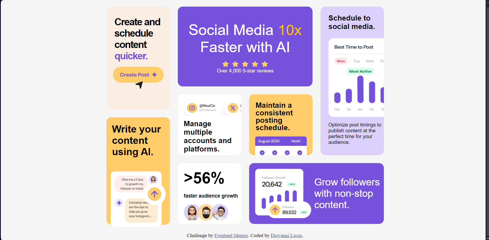

# Frontend Mentor - Bento grid solution

This is a solution to the [Bento grid challenge on Frontend Mentor](https://www.frontendmentor.io/challenges/bento-grid-RMydElrlOj). Frontend Mentor challenges help you improve your coding skills by building realistic projects. 

## Table of contents

- [Overview](#overview)
  - [The challenge](#the-challenge)
  - [Screenshot](#screenshot)
  - [Links](#links)
- [My process](#my-process)
  - [Built with](#built-with)
  - [What I learned](#what-i-learned)
  - [Continued development](#continued-development)
- [Author](#author)

## Overview

### The challenge

Users should be able to:

- View the optimal layout for the interface depending on their device's screen size

### Screenshot

### Links

- Solution URL: [Add solution URL here](https://your-solution-url.com)
- Live Site URL: [Add live site URL here](https://your-live-site-url.com)

## My process
comecei pela criação dos cards no html e a estruturação  do layout, em seguida, adicionei as imagens e os textos, e personalizei as  cores e tamanhos para que se adequassem ao design fornecido com o CSS,  utilizei flexbox para a criação do layout responsivo.
### Built with

- Semantic HTML5 markup
- CSS custom properties
- Flexbox

### What I learned
 neste projeto consegui treinar  a habilidade de criar layouts responsivos com flexbox e a utilização de CSS custom properties para  personalizar as cores e tamanhos dos elementos do layout.
 inclusive, aprendi mais sobre a responsividade, sobre atualizar os formatos e disposição de acordo  com a tela do usuário.

### Continued development

durante o desenvolvimento percebi que preciso treinar sobre mais formas de responsividade. 

## Author

- Website - [Diovanni Lucas](https://www.linkedin.com/in/diovanni-ls2004/)
- GitHub - [Diovanni-ls](https://github.com/Diovanni-ls)
- Frontend Mentor - [@Diovanni-ls](https://www.frontendmentor.io/profile/Diovanni-ls)

